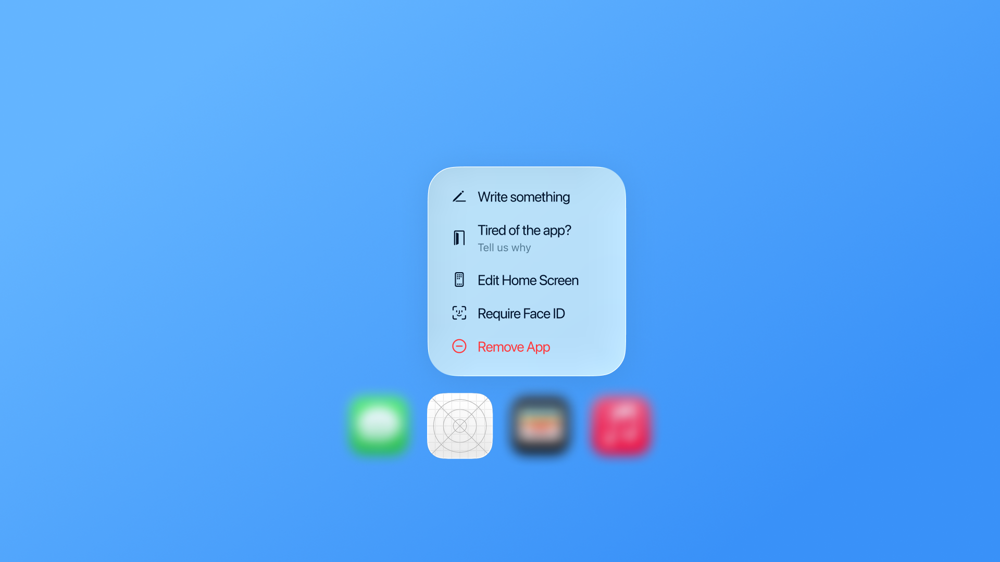

# QuickActionsKit

A lightweight Swift library for configuring and handling Home Screen Quick Actions with minimal setup.

## Overview

QuickActionsKit simplifies the implementation of 3D Touch and long-press shortcuts on your app's Home Screen icon. Whether you're building with SwiftUI or UIKit, QuickActionsKit provides a clean, declarative API to define dynamic quick actions that respond to your application's state.

### Key Features

- **Universal compatibility**: Works seamlessly with both SwiftUI and UIKit projects
- **Dynamic actions**: Update quick actions based on your app's current state
- **Type-safe**: Leverage Swift's type system to prevent runtime errors
- **Lightweight**: Minimal overhead with a focused API surface

### Documentation

You can find the full documentation and usage examples on the [QuickActionsKit Documentation](https://mlbonniec.github.io/QuickActionsKit/).

#### Tutorials
- [Learn how to setup QuickActions for your application.](https://mlbonniec.github.io/QuickActionsKit/tutorials/setup)

#### Quick Example

Define your QuickActions, with a type, title, subtitle, icon, availability and behaviors.

```swift
enum MyQuickActionsType: String, QuickActionType {
    case editor
}

class MyQuickActions: QuickActions {
    func getActions() -> Set<QuickActionsItem<MyQuickActionsType>> {
        [
            QuickActionsItem<MyQuickActionsType>(
                type: .editor,
                title: "Edit",
                subtitle: nil,
                icon: nil,
                availability: {
                    MyApplicationSingleton.current.isUserLogged
                }
            )
        ]
    }
}
```

Then, setup the handler that'll take care of executing the desired actions. We recommend you to conform your `SceneDelegate` to the `QuickActionsHandler`.

```swift
@MainActor
class SceneDelegate: UIResponder, UIWindowSceneDelegate {}

extension SceneDelegate: QuickActionsHandler {
    func handle(_ action: MyQuickActionsType, userInfo: [String:any NSSecureCoding]?) async -> Bool {
        switch action {
        case .home:
            // …
        case .create:
            // …
        }

        return true
    }
}

```

Finally, provide your QuickActions to the `QuickActionsManager` and call `handle(shortcut:)` and `invalidate()` in your application's lifecycle.

```swift
var manager: QuickActionsManager<MyQuickActions, SceneDelegate>?

if let shortcutItem = connectionOptions.shortcutItem {
    Task {
        await manager?.handle(shortcut: shortcutItem)
    }
}

await manager?.handle(shortcut: shortcutItem)
manager?.invalidate()
```

### License

This project is licensed under MIT.  
See [LICENSE](./LICENSE) for more details.
